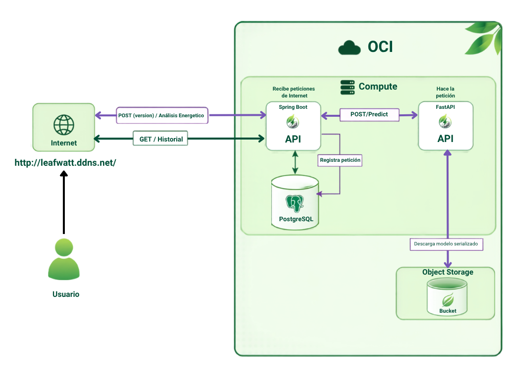
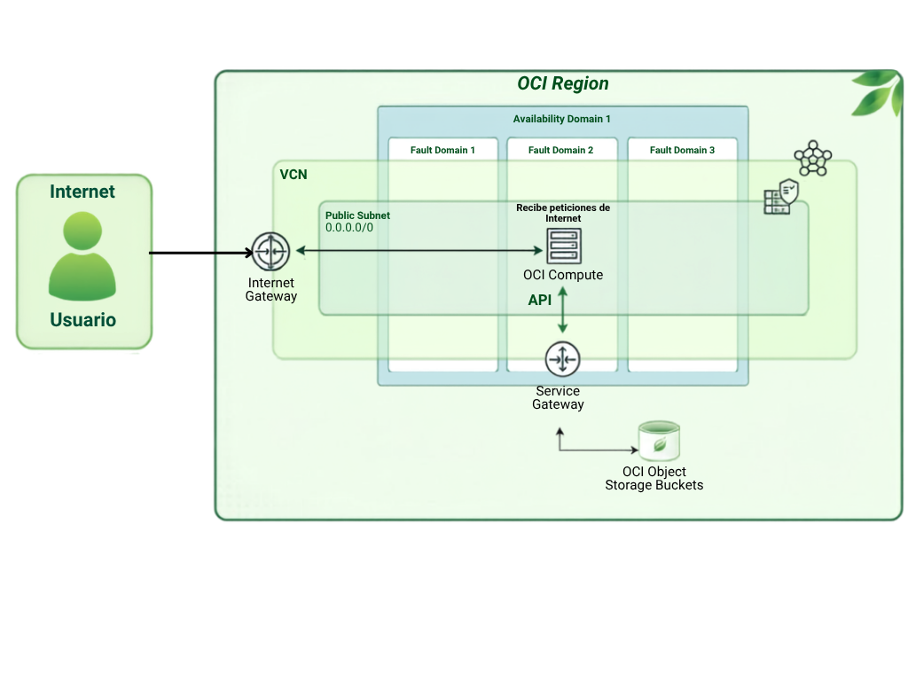

[](https://www.youtube.com/channel/UCgF66HaRWpx01yt8DTqbQzA)
[](https://trello.com/b/c3USs77B/g9-latam-team-33)

# 🍃 Leaf Watt⚡

### Hackathon ONE G9 | Alura Latam + Oracle Next Education


---

**Proyecto desarrollado para el Hackathon ONE G9 de Alura Latam + Oracle Next Education.**

Una solución inteligente que utiliza Ciencia de Datos y Machine Learning
para analizar patrones de consumo energético, clasificar perfiles de eficiencia y
generar recomendaciones personalizadas que ayuden a reducir costos y fomentar un consumo responsable.

**Prueba la aplicacion** 🔗 [https://leafwatt.ddns.net/](https://leafwatt.ddns.net/)

---

# 📑 Índice

- [📌 Descripción](#-descripción)
- [🎯 Objetivos](#-objetivos)
- [📋 Alcance del Proyecto](#-alcance-del-proyecto)
- [💻 Tareas a Realizar](#-tareas-a-realizar)
- [✅ Requisitos](#-requisitos)
- [🔨 Tecnologías que ocupamos](#-tecnologias-que-ocupamos)
- [📊 Ciencia de Datos](#-ciencia-de-datos)
- [▶️ Ejecución](#️-ejecución)
- [📷 Screenshots](#-screenshots)
- [📔 Diagramas](#-diagramas)
- [📂 Estructura del Proyecto](#-estructura-del-proyecto)
- [👥 Equipo](#-equipo)
- [📄 Licencia](#-licencia)

---

# 📌 Descripción

El proyecto consiste en desarrollar una solución inteligente capaz de analizar el consumo de energía eléctrica de viviendas o pequeños establecimientos.

Mediante técnicas de **Ciencia de Datos** y **Machine Learning**, el sistema identificará patrones de consumo, clasificará el nivel de eficiencia energética y ofrecerá recomendaciones personalizadas para disminuir el desperdicio y optimizar el uso de la energía.

Además, la solución calculará una estimación del costo mensual del consumo y expondrá toda la información mediante una **API REST**, integrándose con servicios **Oracle Cloud Infrastructure (OCI)**.

---

# 🎯 Objetivos

## 🎯 Objetivo General

Desarrollar un MVP funcional que permita:

- Analizar patrones de consumo energético.
- Clasificar perfiles de eficiencia energética.
- Generar recomendaciones inteligentes.
- Estimar el costo mensual del consumo.
- Publicar los resultados mediante una API REST.
- Utilizar al menos un servicio de Oracle Cloud Infrastructure (OCI).

---

## 👤 Objetivos Individuales (Consumidores)

### 🏠 Usuario Final

La aplicación permitirá al usuario:

- Comprender su perfil de consumo energético.
- Detectar hábitos que generan desperdicio.
- Recibir recomendaciones personalizadas.
- Conocer el costo mensual estimado.
- Hacer seguimiento de la evolución de su eficiencia energética.

### 👨‍💻 Equipo Desarrollador

El equipo tendrá como objetivos:

- Construir el conjunto de datos.
- Entrenar un modelo de Machine Learning.
- Implementar una API REST.
- Integrar la solución con Oracle Cloud.
- Documentar la arquitectura del proyecto.

---

# 📋 Alcance del Proyecto

El sistema analizará información como:

- Consumo mensual (kWh)
- Horarios de mayor consumo
- Cantidad de equipos eléctricos
- Tipo de inmueble
- Horas de mayor utilización
- Otros indicadores definidos por el equipo

Con estos datos clasificará al usuario en un perfil energético y ofrecerá recomendaciones junto con una estimación financiera.

---

# 💻 Tareas a Realizar

## 📊 Equipo Data

- Recolección de datos.
- Limpieza y preparación (EDA).
- Ingeniería de características.
- Entrenamiento del modelo.
- Evaluación del rendimiento.
- Serialización del modelo.
- Generación de recomendaciones.

## ⚙️ Equipo Back-End

Desarrollar una API REST que permita:

- Recibir datos de consumo.
- Analizar el perfil energético.
- Clasificar la eficiencia.
- Calcular el costo estimado.
- Generar recomendaciones.
- Validar entradas.
- Manejar errores.
- Documentar los endpoints.

---

# ✅ Requisitos

## 🚀 Requisitos del MVP

- [x] Modelo entrenado.
- [x] Clasificación funcional.
- [x] Recomendaciones automáticas.
- [x] Estimación financiera.
- [x] API documentada.
- [x] Integración con OCI.
- [x] Tres ejemplos de uso.

## ⭐ Funcionalidades Opcionales

- [ ] Dashboard interactivo.
- [x] Historial de consultas.
- [ ] Procesamiento mediante CSV.
- [ ] Docker.
- [ ] Pruebas automatizadas.
- [x] Alertas de alto consumo.
- [ ] Visualizaciones gráficas.
- [ ] Comparación entre períodos.
- [ ] Ranking energético.
- [ ] Simulación de ahorro.

## ☁️ Oracle Cloud Infrastructure (OCI)

Implementar al menos uno de los siguientes servicios:

- [x] Object Storage
- [x] OCI Compute
- [ ] OCI Functions
- [ ] OCI Database

---

# 🔨 Tecnologias que ocupamos

#### Lenguajes

- Java 17
- Python 3.12
- JSON

#### Machine Learning

- Python
- Scikit-learn
- Pandas
- Numpy
- Joblib
- Regresión Logística
- Random Forest

### Cloud Computing

- Oracle Cloud Infrastructure (OCI)
- Object Storage (OCI)
- OCI Compute

### Front-End

- HTML5
- CSS3
- JavaScript

### Backend

- Spring Boot
- FastAPI
- nginx
- Uvicorn

### Database

- PostgreSQL
- Hibernate / Spring Data JPA

### DevOps

- Git + Github Actions

### Deployment

- Certbot / Let's Encrypt
- NoIP.com

---

# 📊 Ciencia de Datos

Notebook completo, ejecutable en Google Colab: [`data-science/notebooks/Colab_EnergIA33.ipynb`](data-science/notebooks/Colab_EnergIA33.ipynb) [](https://colab.research.google.com/drive/1KeMMxB_1OCkvIIKjeG6jMWbYgXkpM30e?usp=sharing)

## 📊 Dataset

El dataset utilizado contiene **10.000 registros sintéticos** generados específicamente para el desarrollo y evaluación del proyecto.

| Característica |                    Valor |
| -------------- | -----------------------: |
| Registros      |                   10.000 |
| Categorías     |                        3 |
| Duplicados     |                        0 |
| Formato        |                      CSV |
| Archivo        | `consumo_energetico.csv` |

### Variable objetivo

El modelo busca predecir uno de los siguientes perfiles:

| Categoría          | Descripción                        |
| ------------------ | ---------------------------------- |
| 🟢 **Eficiente**   | Perfil de consumo eficiente        |
| 🟡 **Moderado**    | Perfil con oportunidades de mejora |
| 🔴 **Ineficiente** | Perfil con consumo elevado         |

### Documentación

La generación, limpieza, exploración y preparación del dataset se encuentra documentada en el notebook del proyecto.

> **Nota:** los datos utilizados son sintéticos y fueron generados con fines académicos y de demostración. No representan mediciones reales de consumo energético.

## 🤖 Machine Learning

Se evaluaron dos algoritmos de clasificación:

| Modelo                 | Técnica                  |
| ---------------------- | ------------------------ |
| 🌳 Random Forest       | `RandomForestClassifier` |
| 📈 Regresión Logística | `LogisticRegression`     |

Ambos modelos reciben las mismas variables de entrada y predicen una de las tres categorías de eficiencia energética.

## 🌳 Random Forest

| Técnica                  | Formato                   | Artefacto            |
| ------------------------ | ------------------------- | -------------------- |
| `RandomForestClassifier` | Serializado con `joblib`. | `modelo_consumo.pkl` |

### Configuración

| Parámetro      | Valor |
| -------------- | ----: |
| `n_estimators` |   200 |

### Resultados

| Métrica           | Resultado |
| ----------------- | --------: |
| Accuracy          |  **0.82** |
| F1-score Macro    |  **0.81** |
| F1-score Weighted |  **0.83** |

## 📈 Regresión Logística

| Técnica              | Formato                   | Artefacto            |
| -------------------- | ------------------------- | -------------------- |
| `LogisticRegression` | Serializado con `joblib`. | `EnergiSense-LR.pkl` |

### Configuración

| Parámetro  |   Valor |
| ---------- | ------: |
| `solver`   | `lbfgs` |
| `max_iter` |    1000 |

### Preprocesamiento

| Variable            | Transformación   |
| ------------------- | ---------------- |
| `tipo_inmueble`     | `OneHotEncoder`  |
| Variables numéricas | `StandardScaler` |

### Resultados

| Métrica           | Resultado |
| ----------------- | --------: |
| Accuracy          |  **0.77** |
| F1-score Macro    |  **0.77** |
| F1-score Weighted |  **0.78** |

## 🔬 Ciencia de Datos

### Resumen general

El proyecto implementa un flujo completo de Ciencia de Datos:

| Etapa               | Descripción                                     |
| ------------------- | ----------------------------------------------- |
| 1️⃣ Generación       | Creación del dataset sintético                  |
| 2️⃣ Limpieza         | Revisión y preparación de los datos             |
| 3️⃣ EDA              | Análisis exploratorio                           |
| 4️⃣ Preprocesamiento | Transformación de variables                     |
| 5️⃣ Entrenamiento    | Entrenamiento de los modelos                    |
| 6️⃣ Validación       | Evaluación sobre datos de prueba                |
| 7️⃣ Comparación      | Análisis de Random Forest y Regresión Logística |
| 8️⃣ Predicción       | Clasificación de nuevos casos                   |
| 9️⃣ Indicadores      | Cálculo de métricas adicionales                 |
| 🔟 Recomendaciones  | Generación de recomendaciones personalizadas    |

## 🧪 Validación

Los datos fueron divididos utilizando una proporción:

| Conjunto      | Porcentaje |
| ------------- | ---------: |
| Entrenamiento |        80% |
| Prueba        |        20% |

Se utilizó `stratify` durante la división para mantener una distribución representativa de las categorías.

### Métricas utilizadas

| Métrica             | Objetivo                                      |
| ------------------- | --------------------------------------------- |
| Accuracy            | Medir la proporción de predicciones correctas |
| Precision           | Evaluar la precisión de las predicciones      |
| Recall              | Medir la capacidad de detectar cada clase     |
| F1-score            | Combinar Precision y Recall                   |
| Matriz de confusión | Analizar errores entre categorías             |
| Probabilidad        | Medir la confianza de cada predicción         |

## 🆚 Comparación de modelos

Ambos modelos fueron entrenados utilizando el mismo dataset y evaluados sobre el mismo conjunto de prueba.

| Modelo                 | Accuracy | F1-score |
| ---------------------- | -------: | -------: |
| 🌳 Random Forest       | **0.86** | **0.86** |
| 📈 Regresión Logística | **0.77** | **0.77** |

Además de las métricas generales, se realizaron pruebas con diferentes escenarios de consumo para observar cómo cambia la predicción y la probabilidad asignada por cada modelo.

### ⚠️ Limitaciones

El modelo fue entrenado utilizando **datos sintéticos**, por lo que los resultados deben interpretarse como una demostración del funcionamiento de la solución.

Las categorías **Eficiente, Moderado e Ineficiente** no constituyen un diagnóstico energético profesional.

### Para una implementación productiva sería necesario:

| Acción                       | Objetivo                             |
| ---------------------------- | ------------------------------------ |
| 📊 Utilizar datos reales     | Mejorar la representatividad         |
| 🔄 Reentrenar los modelos    | Adaptarlos a datos reales            |
| ⚖️ Balancear las categorías  | Evitar sesgos                        |
| 👨‍🔬 Validar con especialistas | Validar las categorías               |
| 📈 Monitorear el modelo      | Detectar pérdida de rendimiento      |
| 🔄 Reentrenar periódicamente | Mantener actualizado el modelo       |
| 💡 Mejorar recomendaciones   | Aumentar la utilidad para el usuario |

---

# ▶️ Ejecución

Para ocupar la aplicacion sigua los siguientes pasos:

### 1- Front End

Link a aplicacion - [LeafWatt](https://leafwatt.ddns.net/)
Dentro de la aplicacion rellene sus datos en el formulario y presione el boton **'Calcular'**
Alternativamente puede bajar a la seccion de Consulta de Historial y presionar el boton **'Consultar Historial'**.

### 2- Peticion directa

#### - Analisis energetico

En una aplicacion como **Postman** manda una peticion POST a https://leafwatt.ddns.net/{version}/analisis-energetico `{version} puede ser 'v1' o 'v2'` con un payload **JSON**.

**Ejemplo de peticion:**

```json
{
    "consumo_kwh": 30,
    "uso_horario_pico": true,
    "horas_alto_consumo": 10,
    "cantidad_equipos": 2,
    "cantidad_personas": 2,
    "tipo_inmueble": "Casa",
    "mes": 1
}
```

**Ejemplo de respuesta:**

```json
{
    "categoria": "Moderado",
    "probabilidad": 0.48,
    "recomendaciones": [
        {
            "prioridad": "Alta",
            "impacto": "Alto",
            "mensaje": "Evite utilizar varios equipos de alto consumo simultáneamente durante el horario pico."
        },
        {
            "prioridad": "Baja",
            "impacto": "Bajo",
            "mensaje": "Mejorar el aislamiento de puertas y ventanas ayuda a reducir el uso de calefacción."
        }
    ],
    "costo_estimado_mensual": 337.5,
    "indicadores": {
        "consumo_por_equipo": 50,
        "consumo_por_persona": 75,
        "consumo_por_hora": 150
    }
}
```

#### - Historial de peticiones

**Ejemplo de Request:**

```text
GET https://leafwatt.ddns.net/historial?categoria=Moderado&page=0&size=2
```

**Ejemplo de respuesta:**

```json
{
    "content": [
        { "id": 1, "categoria": "Moderado", "consumo_kwh": 450.0, "...": "..." }
    ],
    "total_elements": 3,
    "total_pages": 2,
    "number": 0,
    "size": 2
}
```

---

# 📷 Screenshots

| ⚡Inicio⚡                                            |
| ----------------------------------------------------- |
|  |

| 🧪Formulario🧪                                                |
| ------------------------------------------------------------- |
|  |

| 📋Resultado📋                                               |
| ----------------------------------------------------------- |
|  |

| 📑Documentacion📑                                                   |
| ------------------------------------------------------------------- |
|  |

| 📑Historial📑                                                  |
| -------------------------------------------------------------- |
|  |

| 📑Resultado Historial📑                                              |
| -------------------------------------------------------------------- |
|  |

---

# 📔 Diagramas

## Diagrama de flujo



## Diagrama OCI



---

# 📂 Estructura del Proyecto

```text
📦 Leaf Watt
│
├── 📁 .github/
│   └── 📁 workflows/
│       └── upload-to-OCI-prod.yml
│
├── 📁 OCI/
│   └── 📁 Functions/
│       └──  📁 makeprediction_arm
│
├── 📁 assets/
│
├── 📁 backend/
│   └── 📁 source/
│
├── 📁 data-science/
│   └── 📁 notebooks/
│       └── Colab_EnergIA33.ipynb
│
├── 📁 demonstration-backend/
│   └── 📁 source/
│
├── 📁 docs/
│
├── 📁 fast-api/
│   └── app.py
│
├── 📁 model-service/
│   ├── 📁 local-test/
│   └── 📁 oci-function/
│
├── .gitignore
└── README.md

```

## Leyenda

- `.github/workflows/` — GitHub Actions workflows para el CI/CD y deployment.
- `OCI/Functions/` — Codigo legacy de OCI Functions.
- `assets/` — Imagenes, iconos y otros recursos estaticos para el proyecto.
- `backend/` — Codigo de produccion para el API Spring Boot.
- `data-science/` — Notebooks con analisis, preprocesamiento, entrenamiento, etc. de la Data.
- `demonstration-backend/` — Codigo de prueba para integracion con OCI.
- `docs/` — Documentacion de la API, Proyecto, etc.
- `fast-api` — Codigo Python/FastAPI de produccion.
- `model-service/` — Primer codigo Python/FastAPI de respaldo.

---

# 👥 Equipo

| Integrante                | Rol              | Responsabilidades                        | Links                                                                                                                |
| ------------------------- | ---------------- | ---------------------------------------- | -------------------------------------------------------------------------------------------------------------------- |
| Jhon Fernando Gomez Villa | Backend          | Desarrollo de la API                     | [Linkedin](https://www.linkedin.com/in/jhon-fernando-gómez-villa-4a6bb6341) - [Github](https://github.com/JHFEGOVI)  |
| Angie Alejandra Vega      | Frontend         | Desarrollo del Front End                 | [Linkedin](https://www.linkedin.com/in/angiealejandravegaromero) - [Github](https://github.com/AngieVegaR)           |
| Jhon Rodríguez            | Ciencia de Datos | Modelado y entrenamiento                 |
| Tomas Raggio              | Ciencia de Datos | Modelado y entrenamiento                 | [Linkedin](https://www.linkedin.com/in/tomás-raggio/) - [Github](https://github.com/innit-tomi)                      |
| Angela Balta              | Ciencia de Datos | Graficos                                 | [Linkedin](https://www.linkedin.com/in/angela-balta-412506140) - [Github](https://github.com/Anel-7)                 |
| Isaac Ruiz                | Ciencia de Datos | Modelado y entrenamiento                 |
| Matias Marquez            | Documentación    | README y presentación                    | [Linkedin](https://www.linkedin.com/in/matias-ivan-marquez-b05888378/) - [Github](https://github.com/MarquezIMatias) |
| Josue Marquez             | Project Manager  | Organizar proyecto y Integración con OCI | [Linkedin](https://www.linkedin.com/in/josuemarquez/) - [Github](https://github.com/owaruuu)                         |

---

# 📄 Licencia

Este proyecto fue desarrollado con fines educativos como parte del **Hackathon ONE G9 - Alura Latam + Oracle Next Education**.

No está destinado a uso comercial.

---
